# **Comunicación entre servicios**

## 1. **Error por inexistencia de restaurante**

### **Json a enviar:**
```json
{
  "restaurant_id": "8209e1cf-f337-4f0c-92c3-45aa753513cb",
  "client_id": "8209e1cf-f337-4f0c-92c3-45aa753513cb",
  "items": [
    {
      "menu_item_id": "9914aad2-5678-4c4d-b74b-23af4b40dd33",
      "quantity": 2,
      "price": 85.50,
      "product_name": "Caldo de rez"
    },
    {
      "menu_item_id": "fec28fce-0a5a-4739-87e7-b5d98e7ada46",
      "quantity": 1,
      "price": 95.00,
      "product_name": "Pepián de Pollo Especial 2"
    }
  ]
}

```

<div align="center">
  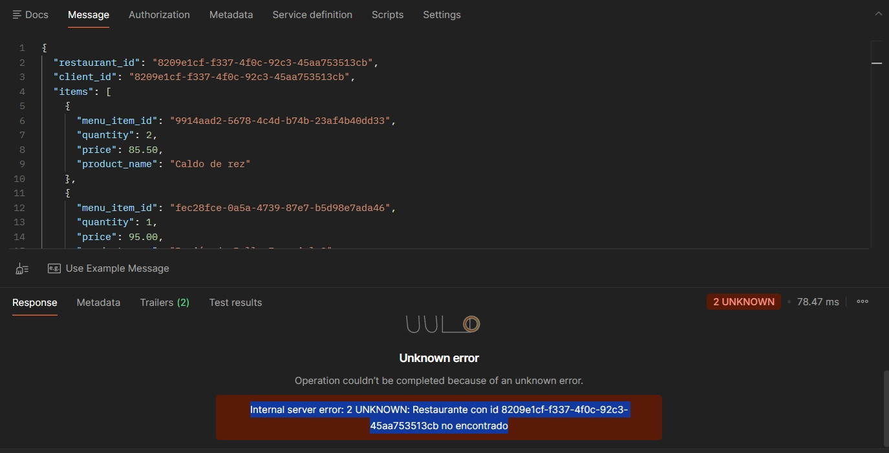
  <p><i>Figura 1: Error por inexistencia de restaurante en petición grpc.</i></p>
</div>

<div align="center">
  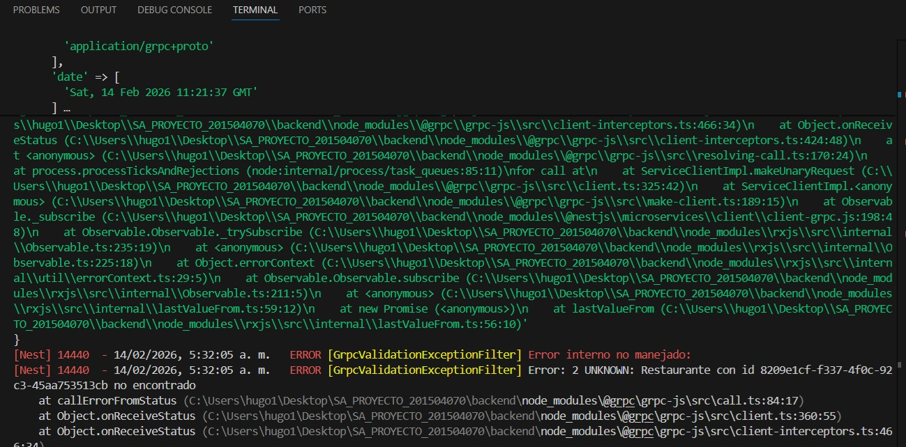
  <p><i>Figura 2: Error en consola por inexistencia de restaurante.</i></p>
</div>

---

## 2. **Error de producto no pertence a restaurante**

### **Json a enviar:**
```json
{
  "restaurant_id": "f595aab9-094d-11f1-998c-002b6738278b",
  "client_id": "8209e1cf-f337-4f0c-92c3-45aa753513cb",
  "items": [
    {
      "menu_item_id": "9914aad2-5678-4c4d-b74b-23af4b40dd33",
      "quantity": 2,
      "price": 85.50,
      "product_name": "Caldo de rez"
    },
    {
      "menu_item_id": "fec28fce-0a5a-4739-87e7-b5d98e7ada46",
      "quantity": 1,
      "price": 95.00,
      "product_name": "Pepián de Pollo Especial 2"
    }
  ]
}

```

<div align="center">
  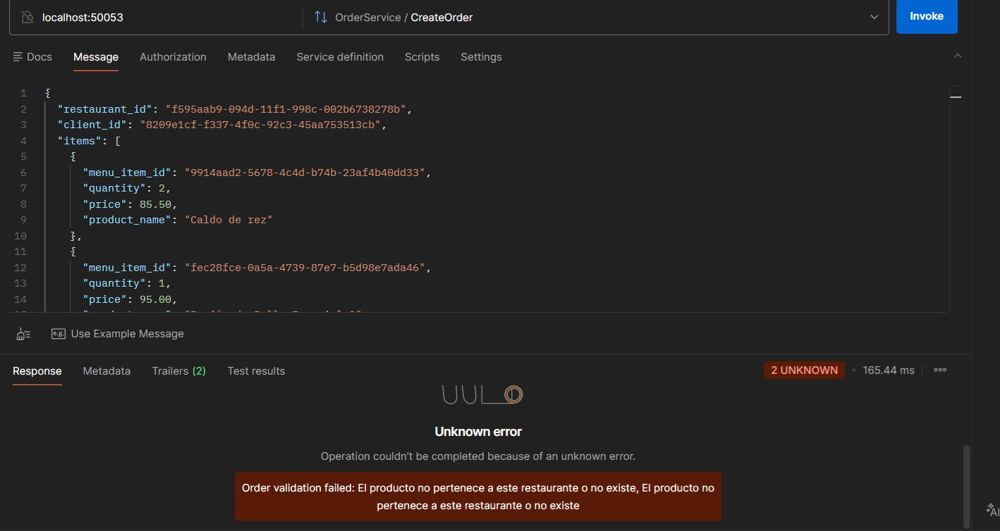
  <p><i>Figura 3: Error de productos a verificar no pertenecen al restaurante.</i></p>
</div>

<div align="center">
  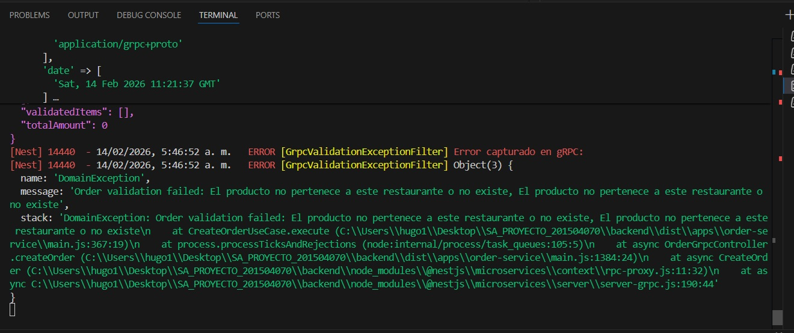
  <p><i>Figura 4: Error en consola de productos a verificar no pertenecen al restaurante.</i></p>
</div>

---

## 3. **Error de precio no coincide con el registrado en base de datos**

### **Json a enviar:**
```json
{
  "restaurant_id": "f595aab9-094d-11f1-998c-002b6738278b",
  "client_id": "8209e1cf-f337-4f0c-92c3-45aa753513cb",
  "items": [
    {
      "menu_item_id": "000a7e29-b065-4857-8a79-64aed78fa9e1",
      "quantity": 2,
      "price": 85.50,
      "product_name": "Caldo de rez"
    },
    {
      "menu_item_id": "008f261b-7e1f-4cc4-941d-7a5e257224ad",
      "quantity": 1,
      "price": 95.00,
      "product_name": "Pepián de Pollo Especial 2"
    }
  ]
}

```
<div align="center">
  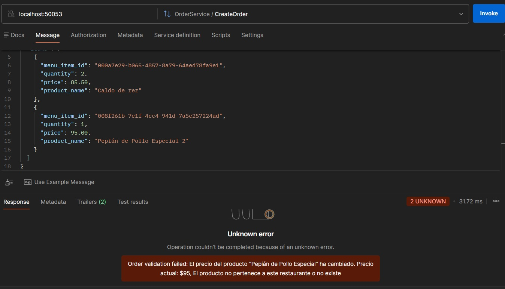
  <p><i>Figura 5: Error de precio de producto no coincide con el registrado.</i></p>
</div>

<div align="center">
  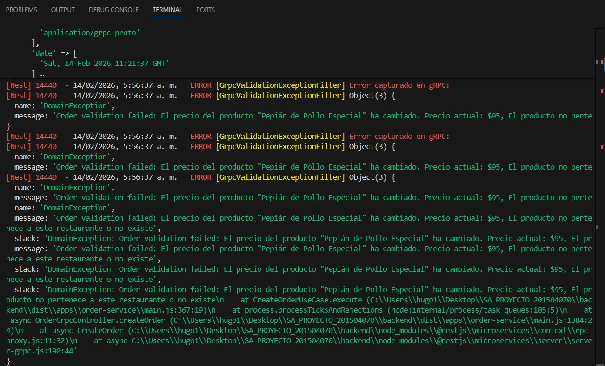
  <p><i>Figura 6: Error en consola de precio de producto no coincide con el registrado.</i></p>
</div>

---

## 4. **Error de nombre no coincide con el id del producto**

### **Json a enviar:**
```json
{
  "restaurant_id": "f595ceec-094d-11f1-998c-002b6738278b",
  "client_id": "8209e1cf-f337-4f0c-92c3-45aa753513cb",
  "items": [
    {
      "menu_item_id": "000a7e29-b065-4857-8a79-64aed78fa9e1",
      "quantity": 2,
      "price": 95.00,
      "product_name": "Pepián de Pollo Especial"
    },
    {
      "menu_item_id": "008f261b-7e1f-4cc4-941d-7a5e257224ad",
      "quantity": 1,
      "price": 3.00,
      "product_name": "Pepián de Pollo Especial 2"
    }
  ]
}

```

<div align="center">
  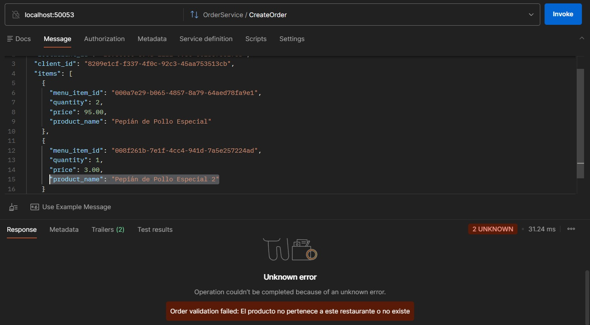
  <p><i>Figura 7: Error de nombre no coincide con el id del producto.</i></p>
</div>

<div align="center">
  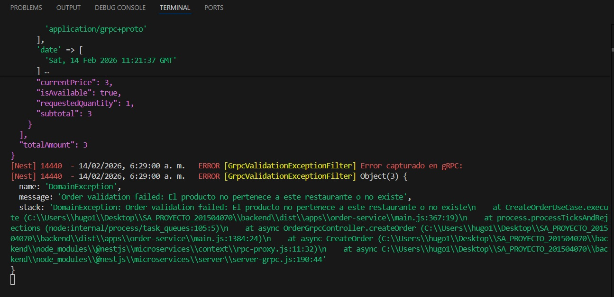
  <p><i>Figura 8: Error en consola de nombre no coincide con el id del producto.</i></p>
</div>

---

## 5. **Error de falta de productos en la consulta**

### **Json a enviar:**
```json
{
  "restaurant_id": "f595ceec-094d-11f1-998c-002b6738278b",
  "client_id": "8209e1cf-f337-4f0c-92c3-45aa753513cb",
  "items": []
}

```

<div align="center">
  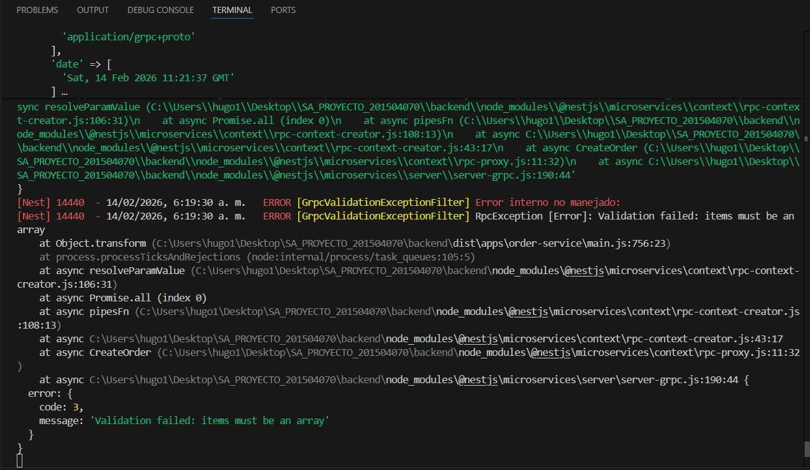
  <p><i>Figura 9: Error de falta de productos en la consulta.</i></p>
</div>

<div align="center">
  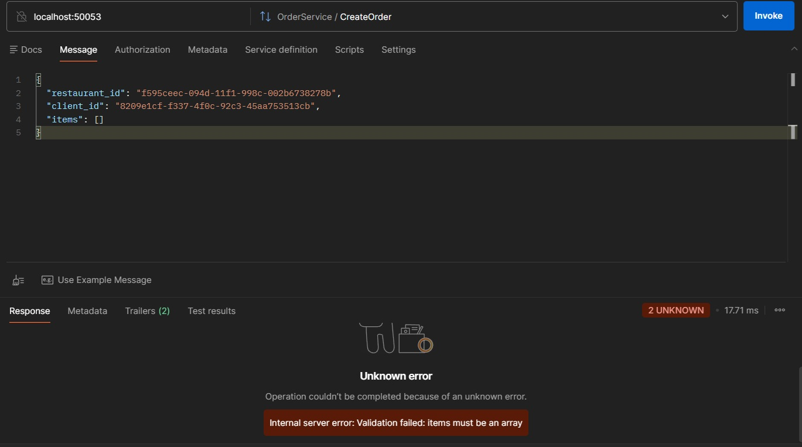
  <p><i>Figura 10: Error en consola de falta de productos en la consulta.</i></p>
</div>

---

### Tabla que se usa para realizar las pruebas de errores:

<div align="center">
  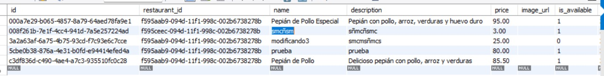
  <p><i>Figura 11: Tabla de productos de restaurante con la que se realizó las pruebas de errores.</i></p>
</div>

---

## **Lógica de Verificación:** 

```
Frontend
   ↓
API Gateway (HTTP)
   ↓
Order Service (gRPC)
   ↓
Restaurant Catalog Service (gRPC)
```

---

## **Logs validos de ingreso de productos**

<div align="center">
  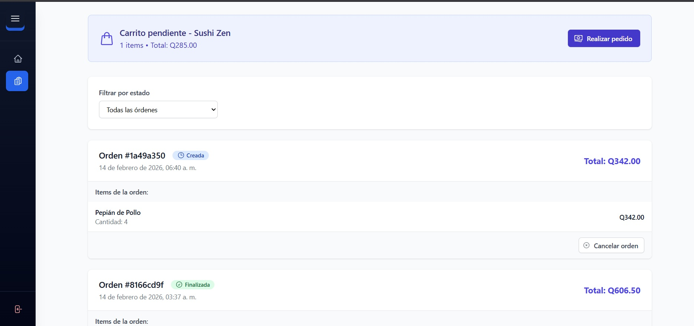
  <p><i>Figura 12: Creación del pedido en el front.</i></p>
</div>

<div align="center">
  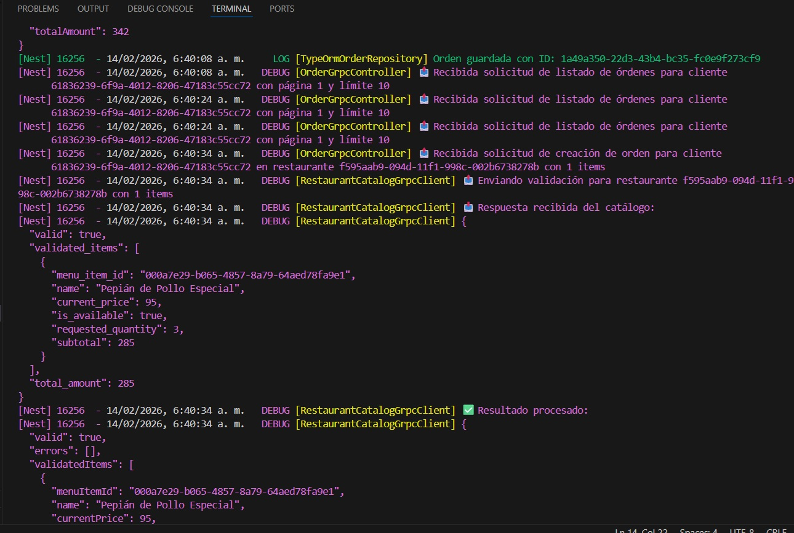
  <p><i>Figura 13: Registro de logs del ingreso de 5 productos validos.</i></p>
</div>

### **Logs completos tras registrar 5 productos**
```
 Order-Service gRPC running on port 50053
No typescript errors found.
[Nest] 16256  - 14/02/2026, 6:39:57 a. m.   DEBUG [OrderGrpcController] 📤 Recibida solicitud de listado de órdenes para cliente 
      61836239-6f9a-4012-8206-47183c55cc72 con página 1 y límite 10
[Nest] 16256  - 14/02/2026, 6:39:57 a. m.   DEBUG [OrderGrpcController] 📤 Recibida solicitud de listado de órdenes para cliente 
      61836239-6f9a-4012-8206-47183c55cc72 con página 1 y límite 10
[Nest] 16256  - 14/02/2026, 6:40:08 a. m.   DEBUG [OrderGrpcController] 📤 Recibida solicitud de creación de orden para cliente 
      61836239-6f9a-4012-8206-47183c55cc72 en restaurante f595aab9-094d-11f1-998c-002b6738278b con 1 items
[Nest] 16256  - 14/02/2026, 6:40:08 a. m.   DEBUG [RestaurantCatalogGrpcClient] 📤 Enviando validación para restaurante f595aab9-094d-11f1-998c-002b6738278b con 1 items
[Nest] 16256  - 14/02/2026, 6:40:08 a. m.   DEBUG [RestaurantCatalogGrpcClient] 📥 Respuesta recibida del catálogo:
[Nest] 16256  - 14/02/2026, 6:40:08 a. m.   DEBUG [RestaurantCatalogGrpcClient] {
  "valid": true,
  "validated_items": [
    {
      "menu_item_id": "c3df836d-c490-4ae4-a7c3-935510fc0c28",
      "name": "Pepián de Pollo",
      "current_price": 85.5,
      "is_available": true,
      "requested_quantity": 4,
      "subtotal": 342
    }
  ],
  "total_amount": 342
}
[Nest] 16256  - 14/02/2026, 6:40:08 a. m.   DEBUG [RestaurantCatalogGrpcClient] ✅ Resultado procesado:
[Nest] 16256  - 14/02/2026, 6:40:08 a. m.   DEBUG [RestaurantCatalogGrpcClient] {
  "valid": true,
  "errors": [],
  "validatedItems": [
    {
      "menuItemId": "c3df836d-c490-4ae4-a7c3-935510fc0c28",
      "name": "Pepián de Pollo",
      "currentPrice": 85.5,
      "isAvailable": true,
      "requestedQuantity": 4,
      "subtotal": 342
    }
  ],
  "totalAmount": 342
}
[Nest] 16256  - 14/02/2026, 6:40:08 a. m.     LOG [TypeOrmOrderRepository] Orden guardada con ID: 1a49a350-22d3-43b4-bc35-fc0e9f273cf9
[Nest] 16256  - 14/02/2026, 6:40:08 a. m.   DEBUG [OrderGrpcController] 📤 Recibida solicitud de listado de órdenes para cliente 
      61836239-6f9a-4012-8206-47183c55cc72 con página 1 y límite 10
[Nest] 16256  - 14/02/2026, 6:40:24 a. m.   DEBUG [OrderGrpcController] 📤 Recibida solicitud de listado de órdenes para cliente 
      61836239-6f9a-4012-8206-47183c55cc72 con página 1 y límite 10
[Nest] 16256  - 14/02/2026, 6:40:24 a. m.   DEBUG [OrderGrpcController] 📤 Recibida solicitud de listado de órdenes para cliente 
      61836239-6f9a-4012-8206-47183c55cc72 con página 1 y límite 10
[Nest] 16256  - 14/02/2026, 6:40:34 a. m.   DEBUG [OrderGrpcController] 📤 Recibida solicitud de creación de orden para cliente 
      61836239-6f9a-4012-8206-47183c55cc72 en restaurante f595aab9-094d-11f1-998c-002b6738278b con 1 items
[Nest] 16256  - 14/02/2026, 6:40:34 a. m.   DEBUG [RestaurantCatalogGrpcClient] 📤 Enviando validación para restaurante f595aab9-094d-11f1-998c-002b6738278b con 1 items
[Nest] 16256  - 14/02/2026, 6:40:34 a. m.   DEBUG [RestaurantCatalogGrpcClient] 📥 Respuesta recibida del catálogo:
[Nest] 16256  - 14/02/2026, 6:40:34 a. m.   DEBUG [RestaurantCatalogGrpcClient] {
  "valid": true,
  "validated_items": [
    {
      "menu_item_id": "000a7e29-b065-4857-8a79-64aed78fa9e1",
      "name": "Pepián de Pollo Especial",
      "current_price": 95,
      "is_available": true,
      "requested_quantity": 3,
      "subtotal": 285
    }
  ],
  "total_amount": 285
}
[Nest] 16256  - 14/02/2026, 6:40:34 a. m.   DEBUG [RestaurantCatalogGrpcClient] ✅ Resultado procesado:
[Nest] 16256  - 14/02/2026, 6:40:34 a. m.   DEBUG [RestaurantCatalogGrpcClient] {
  "valid": true,
  "errors": [],
  "validatedItems": [
    {
      "menuItemId": "000a7e29-b065-4857-8a79-64aed78fa9e1",
      "name": "Pepián de Pollo Especial",
      "currentPrice": 95,
      "isAvailable": true,
      "requestedQuantity": 3,
      "subtotal": 285
    }
  ],
  "totalAmount": 285
}
[Nest] 16256  - 14/02/2026, 6:40:34 a. m.     LOG [TypeOrmOrderRepository] Orden guardada con ID: 43699cd9-1f5a-4875-82cf-4aa246f03bf8
[Nest] 16256  - 14/02/2026, 6:40:34 a. m.   DEBUG [OrderGrpcController] 📤 Recibida solicitud de listado de órdenes para cliente 
      61836239-6f9a-4012-8206-47183c55cc72 con página 1 y límite 10
[Nest] 16256  - 14/02/2026, 6:41:48 a. m.   DEBUG [OrderGrpcController] 📤 Recibida solicitud de listado de órdenes para cliente 
      61836239-6f9a-4012-8206-47183c55cc72 con página 1 y límite 10
[Nest] 16256  - 14/02/2026, 6:41:48 a. m.   DEBUG [OrderGrpcController] 📤 Recibida solicitud de listado de órdenes para cliente 
      61836239-6f9a-4012-8206-47183c55cc72 con página 1 y límite 10
[Nest] 16256  - 14/02/2026, 6:41:50 a. m.   DEBUG [OrderGrpcController] 📤 Recibida solicitud de creación de orden para cliente 
      61836239-6f9a-4012-8206-47183c55cc72 en restaurante f595ceec-094d-11f1-998c-002b6738278b con 1 items
[Nest] 16256  - 14/02/2026, 6:41:50 a. m.   DEBUG [RestaurantCatalogGrpcClient] 📤 Enviando validación para restaurante f595ceec-094d-11f1-998c-002b6738278b con 1 items
[Nest] 16256  - 14/02/2026, 6:41:50 a. m.   DEBUG [RestaurantCatalogGrpcClient] 📥 Respuesta recibida del catálogo:
[Nest] 16256  - 14/02/2026, 6:41:50 a. m.   DEBUG [RestaurantCatalogGrpcClient] {
  "valid": true,
  "validated_items": [
    {
      "menu_item_id": "008f261b-7e1f-4cc4-941d-7a5e257224ad",
      "name": "smcñsm",
      "current_price": 3,
      "is_available": true,
      "requested_quantity": 1,
      "subtotal": 3
    }
    }
  ],
    }
  ],
  "total_amount": 3
}
    }
  ],
    }
  ],
    }
  ],
  "total_amount": 3
}
[Nest] 16256  - 14/02/2026, 6:41:50 a. m.   DEBUG [RestaurantCatalogGrpcClient] ✅ Resultado procesado:
    }
  ],
  "total_amount": 3
}
[Nest] 16256  - 14/02/2026, 6:41:50 a. m.   DEBUG [RestaurantCatalogGrpcClient] ✅ Resultado procesado:
[Nest] 16256  - 14/02/2026, 6:41:50 a. m.   DEBUG [RestaurantCatalogGrpcClient] {
  "total_amount": 3
}
[Nest] 16256  - 14/02/2026, 6:41:50 a. m.   DEBUG [RestaurantCatalogGrpcClient] ✅ Resultado procesado:
[Nest] 16256  - 14/02/2026, 6:41:50 a. m.   DEBUG [RestaurantCatalogGrpcClient] {
  "valid": true,
  "errors": [],
  "valid": true,
  "errors": [],
  "validatedItems": [
    {
      "menuItemId": "008f261b-7e1f-4cc4-941d-7a5e257224ad",
  "validatedItems": [
    {
      "menuItemId": "008f261b-7e1f-4cc4-941d-7a5e257224ad",
      "name": "smcñsm",
      "currentPrice": 3,
      "name": "smcñsm",
      "currentPrice": 3,
      "isAvailable": true,
      "isAvailable": true,
      "requestedQuantity": 1,
      "requestedQuantity": 1,
      "subtotal": 3
    }
    }
  ],
  ],
  "totalAmount": 3
}
[Nest] 16256  - 14/02/2026, 6:41:50 a. m.     LOG [TypeOrmOrderRepository] Orden guardada con ID: 449fede3-4e33-48e6-b88b-84c3bc6d9c92      
[Nest] 16256  - 14/02/2026, 6:41:50 a. m.   DEBUG [OrderGrpcController] 📤 Recibida solicitud de listado de órdenes para cliente
      61836239-6f9a-4012-8206-47183c55cc72 con página 1 y límite 10
```

## **Notificación de error al usuario**

### Para mostrar las validaciones se forzó un error en el precio de un producto.

1. Se ingresó al frontend y se listó los menús de un restaurante. 

<div align="center">
  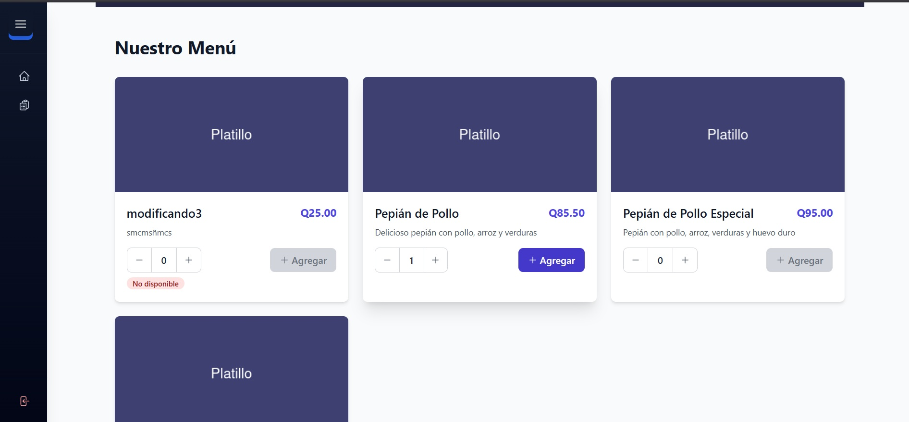
  <p><i>Figura 14: Lista de menús de un restaurante seleccionado en el frontend.</i></p>
</div>

2. Antes de dar click al botón de agregar, se cambió en base de datos el precio de dicho producto. Pasando de 85.50 a 20.0

<div align="center">
  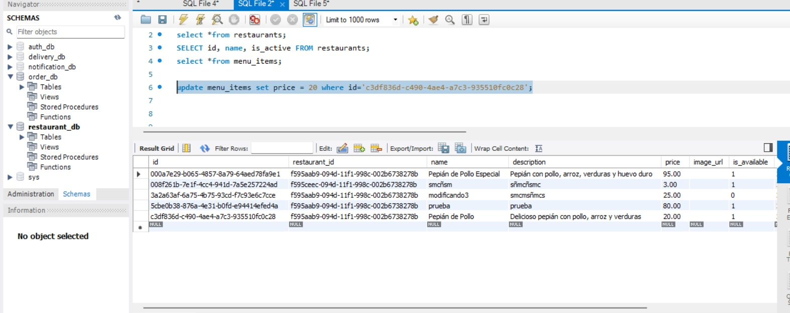
  <p><i>Figura 15: Update en base de datos a precio de producto con id = 'c3df836d-c490-4ae4-a7c3-935510fc0c28'.</i></p>
</div>

3. Al haber cambiado el precio, se procedió a intentar realizar la orden pero los métodos de validación entre los microservicios de orden y restaurante verifican antes de ingresar los datos que los precios (y demas datos) coincidan con los registrados y en este caso no coincidieron por lo que se le mandó un mensaje de error al frontend.

<div align="center">
  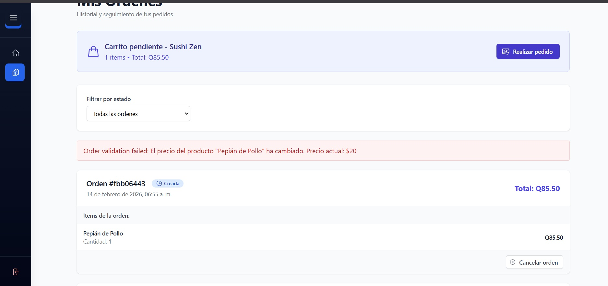
  <p><i>Figura 16: Error en frontend por falta de coincidencia entre el precio enviado y el recibido.</i></p>
</div>