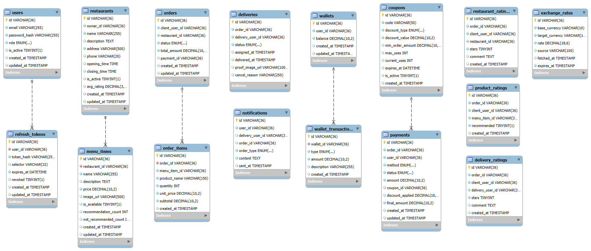
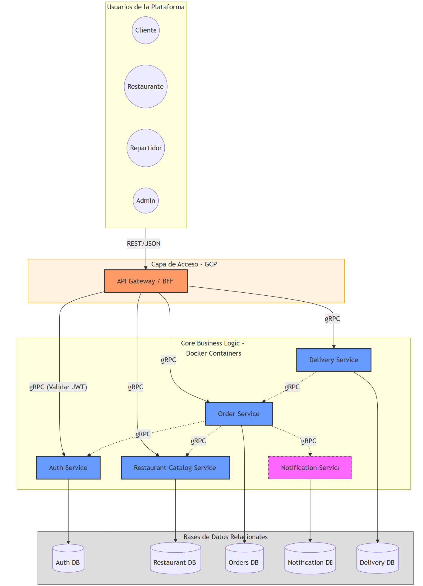
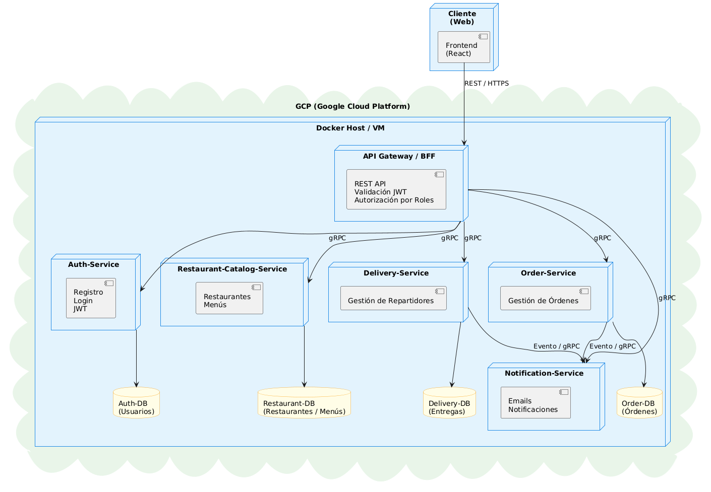
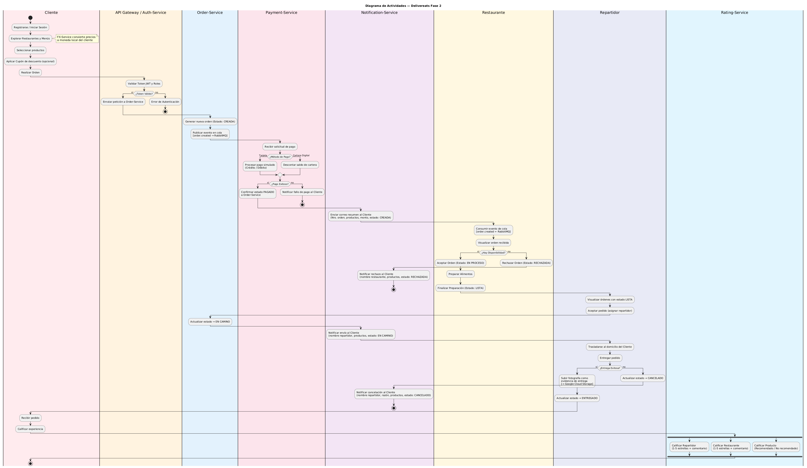

# Documentación de Requerimientos - Plataforma de Delivery (Microservicios)

## 1. Requerimientos Funcionales (RF)

Los requerimientos funcionales describen las interacciones entre el sistema y sus actores, definiendo las capacidades y servicios que la plataforma debe ofrecer.

### Módulo: Autenticación y Usuarios (Auth-Service)

*   **RF-01: Registro de Usuario**
    El sistema debe permitir que un nuevo usuario (Cliente, Restaurante, Repartidor) se registre proporcionando un email, una contraseña y seleccionando un rol. El sistema debe validar que el email no esté registrado previamente y almacenar la contraseña de forma encriptada.
*   **RF-02: Inicio de Sesión (Login)**
    El sistema debe permitir que un usuario registrado inicie sesión proporcionando su email y contraseña. El sistema verificará las credenciales y, si son correctas, generará un token de acceso.
*   **RF-03: Generación y Validación de JWT**
    El sistema debe generar un JSON Web Token (JWT) tras un inicio de sesión exitoso, que contenga la información del usuario (ID, email, rol). Este servicio también debe ser capaz de validar cualquier JWT presentado a otros servicios para garantizar la autenticidad de la petición.

### Módulo: Catálogo de Restaurantes (Restaurant-Catalog-Service)

*   **RF-04: Gestión de Restaurantes (CRUD)**
    El sistema debe permitir a un usuario con rol de **ADMINISTRADOR** crear, leer, actualizar y eliminar restaurantes en la plataforma (nombre, dirección, horarios, contacto).
*   **RF-05: Gestión de Menús (CRUD)**
    El sistema debe permitir a un usuario con rol de **RESTAURANTE** crear, leer, actualizar y eliminar los ítems del menú de su propio restaurante (nombre del platillo, descripción, precio, disponibilidad).
*   **RF-06: Consultar Catálogo de Restaurantes**
    El sistema debe permitir a un usuario con rol de **CLIENTE** visualizar un listado de todos los restaurantes disponibles en la plataforma.
*   **RF-07: Consultar Menú de un Restaurante**
    El sistema debe permitir a un usuario con rol de **CLIENTE** visualizar el menú completo de un restaurante específico, mostrando los ítems activos con sus precios y descripciones.

### Módulo: Gestión de Pedidos (Order-Service)

*   **RF-08: Realizar un Pedido**
    El sistema debe permitir a un usuario con rol de **CLIENTE** crear una nueva orden a partir de los productos seleccionados de un restaurante. La orden se creará inicialmente con estado "CREADA".
*   **RF-09: Cancelar un Pedido (Cliente)**
    El sistema debe permitir a un usuario con rol de **CLIENTE** cancelar una orden propia que aún no haya sido aceptada por el restaurante, cambiando su estado a "CANCELADA".
*   **RF-10: Gestionar Pedido (Restaurante)**
    El sistema debe permitir a un usuario con rol de **RESTAURANTE** visualizar las nuevas órdenes, aceptarlas (cambiando el estado a "EN PROCESO") y marcarlas como "LISTAS" para su entrega una vez finalizada su preparación.
*   **RF-11: Rechazar un Pedido (Restaurante)**
    El sistema debe permitir a un usuario con rol de **RESTAURANTE** rechazar una orden entrante (por falta de stock o personal), cambiando su estado a "RECHAZADA".

### Módulo: Gestión de Entregas (Delivery-Service)

*   **RF-12: Aceptar un Pedido para Entrega**
    El sistema debe permitir a un usuario con rol de **REPARTIDOR** visualizar los pedidos que están "LISTOS" para entrega y aceptar uno, cambiando el estado del pedido a "EN CAMINO".
*   **RF-13: Actualizar Estado de Entrega**
    El sistema debe permitir a un usuario con rol de **REPARTIDOR** actualizar el estado de un pedido que ha aceptado a "ENTREGADO" (al completar la entrega) o a "CANCELADO" (si ocurre un percance durante el trayecto).

### Módulo: Notificaciones (Notification-Service)

*   **RF-14: Notificar Creación de Pedido**
    El sistema debe enviar una notificación por correo electrónico al **CLIENTE** cuando este realice un pedido, incluyendo el resumen del mismo.
*   **RF-15: Notificar Cancelación de Pedido (por Cliente)**
    El sistema debe notificar al **CLIENTE** por correo electrónico cuando este cancele exitosamente un pedido.
*   **RF-16: Notificar Pedido en Camino**
    El sistema debe notificar al **CLIENTE** por correo electrónico cuando su pedido sea aceptado por un repartidor y el estado cambie a "EN CAMINO".
*   **RF-17: Notificar Cancelación/Rechazo de Pedido**
    El sistema debe notificar al **CLIENTE** por correo electrónico cuando su pedido sea rechazado por el restaurante o cancelado por el repartidor, incluyendo el motivo de la cancelación.

---

## 2. Requerimientos No Funcionales (RNF) y Atributos de Calidad

Los requerimientos no funcionales especifican criterios que describen la operación del sistema en lugar de sus comportamientos específicos.

*   **RNF-01: Seguridad**
    *   **Autenticación y Autorización:** El acceso a los microservicios debe estar protegido mediante tokens JWT válidos. El API Gateway debe validar el token y verificar los roles (CLIENTE, RESTAURANTE, REPARTIDOR, ADMIN) antes de enrutar la petición.
    *   **Confidencialidad:** Las contraseñas de los usuarios deben ser almacenadas utilizando un algoritmo de hashing seguro (ej. bcrypt). Todas las comunicaciones entre el cliente y el servidor, y entre microservicios, deben realizarse a través de canales seguros (HTTPS/gRPC con TLS).
*   **RNF-02: Rendimiento y Escalabilidad**
    *   La arquitectura de microservicios debe permitir el escalado horizontal independiente de cada servicio. Por ejemplo, el `Order-Service` debe poder escalarse para soportar picos de demanda en horas pico sin afectar al `Auth-Service`.
    *   Las consultas al catálogo de restaurantes y menús (`Restaurant-Catalog-Service`) deben responder en un tiempo máximo de 500ms para garantizar una experiencia de usuario fluida.
*   **RNF-03: Disponibilidad**
    *   El sistema debe estar diseñado para tolerar fallos en servicios individuales. Si el `Notification-Service` falla, no debe impedir que un usuario realice un pedido. Los pedidos se procesarán y las notificaciones podrán encolarse o reintentarse más tarde.
*   **RNF-04: Mantenibilidad**
    *   El código fuente de cada microservicio debe estar desacoplado y ser desarrollado, probado y desplegado de forma independiente. Debe seguirse un conjunto de buenas prácticas de diseño y estándares de codificación para facilitar el mantenimiento y la incorporación de nuevas funcionalidades.
*   **RNF-05: Usabilidad**
    *   La plataforma debe ofrecer una interfaz intuitiva que guíe al usuario a través del proceso de registro, exploración de restaurantes y creación de pedidos, minimizando la cantidad de pasos y la curva de aprendizaje.

---

## 3. Casos de Uso

A continuación, se describen los casos de uso principales para los actores identificados.

### Actor: Cliente

*   **Caso de Uso: CU-01 - Registrarse en la Plataforma**
    *   **Actores:** Cliente (potencial)
    *   **Descripción:** El usuario ingresa sus datos (email, contraseña) y selecciona el rol "CLIENTE" para crear una cuenta en el sistema.
    *   **Flujo Principal:**
        1.  El usuario accede a la opción de registro.
        2.  El sistema solicita email, contraseña y rol.
        3.  El usuario ingresa los datos y selecciona "CLIENTE".
        4.  El sistema valida que el email no exista.
        5.  El sistema encripta la contraseña y almacena el nuevo usuario.
        6.  El sistema confirma el registro exitoso.

*   **Caso de Uso: CU-02 - Iniciar Sesión**
    *   **Actores:** Cliente
    *   **Descripción:** El usuario se autentica en la plataforma para acceder a las funcionalidades protegidas.
    *   **Flujo Principal:**
        1.  El usuario accede a la opción de inicio de sesión.
        2.  El sistema solicita email y contraseña.
        3.  El usuario ingresa sus credenciales.
        4.  El sistema valida las credenciales.
        5.  El sistema genera un JWT y lo devuelve al usuario.
        6.  El usuario accede al sistema con su token.

*   **Caso de Uso: CU-03 - Explorar Restaurantes y Menús**
    *   **Actores:** Cliente (Autenticado)
    *   **Descripción:** El usuario navega por la lista de restaurantes disponibles y consulta el menú de uno en específico.
    *   **Flujo Principal:**
        1.  El usuario solicita ver el listado de restaurantes.
        2.  El sistema muestra los restaurantes disponibles.
        3.  El usuario selecciona un restaurante de su interés.
        4.  El sistema muestra el menú completo de ese restaurante.

*   **Caso de Uso: CU-04 - Realizar un Pedido**
    *   **Actores:** Cliente (Autenticado)
    *   **Descripción:** El usuario selecciona productos del menú de un restaurante y genera una orden de compra.
    *   **Flujo Principal:**
        1.  El usuario, desde el menú de un restaurante, añade productos a un "carrito".
        2.  El usuario confirma la selección y procede a crear el pedido.
        3.  El sistema registra el pedido con estado "CREADA".
        4.  El sistema (a través de `Notification-Service`) envía un email de confirmación al cliente.
        5.  El sistema notifica al restaurante del nuevo pedido.

*   **Caso de Uso: CU-05 - Cancelar un Pedido**
    *   **Actores:** Cliente (Autenticado)
    *   **Descripción:** El usuario decide cancelar un pedido que ha realizado previamente y que aún no ha sido procesado por el restaurante.
    *   **Flujo Principal:**
        1.  El usuario consulta el estado de sus pedidos activos.
        2.  El sistema muestra los pedidos con estado "CREADA".
        3.  El usuario selecciona la opción "Cancelar" en uno de ellos.
        4.  El sistema cambia el estado del pedido a "CANCELADA".
        5.  El sistema (a través de `Notification-Service`) envía un email de cancelación al cliente.

### Actor: Restaurante

*   **Caso de Uso: CU-06 - Gestionar Menú**
    *   **Actores:** Restaurante (Autenticado)
    *   **Descripción:** El usuario (dueño del restaurante) añade, modifica o elimina platillos de su menú.
    *   **Flujo Principal (Añadir ítem):**
        1.  El restaurante accede al panel de gestión de su menú.
        2.  El sistema muestra los ítems actuales.
        3.  El restaurante selecciona "Añadir nuevo ítem".
        4.  El sistema solicita nombre, descripción, precio.
        5.  El restaurante ingresa los datos y confirma.
        6.  El sistema guarda el nuevo ítem en el menú.

*   **Caso de Uso: CU-07 - Gestionar Pedido Recibido**
    *   **Actores:** Restaurante (Autenticado)
    *   **Descripción:** El restaurante visualiza los pedidos entrantes y decide si aceptarlos, rechazarlos o marcarlos como listos.
    *   **Flujo Principal (Aceptar Pedido):**
        1.  El restaurante accede al listado de pedidos pendientes (estado "CREADA").
        2.  El sistema muestra los nuevos pedidos.
        3.  El restaurante selecciona un pedido y lo acepta.
        4.  El sistema cambia el estado del pedido a "EN PROCESO".
    *   **Flujo Alternativo (Rechazar Pedido):**
        1.  El restaurante selecciona un pedido y elige "Rechazar".
        2.  El sistema solicita una razón para la cancelación.
        3.  El restaurante ingresa el motivo.
        4.  El sistema cambia el estado del pedido a "RECHAZADA" y notifica al cliente.

### Actor: Repartidor

*   **Caso de Uso: CU-08 - Aceptar y Entregar un Pedido**
    *   **Actores:** Repartidor (Autenticado)
    *   **Descripción:** El repartidor toma un pedido que ya está listo en el restaurante y lo entrega al cliente.
    *   **Flujo Principal:**
        1.  El repartidor consulta los pedidos disponibles para entregar (estado "LISTA").
        2.  El sistema muestra la lista de pedidos listos.
        3.  El repartidor selecciona uno y lo acepta.
        4.  El sistema cambia el estado del pedido a "EN CAMINO" y notifica al cliente.
        5.  El repartidor, al llegar al destino, marca el pedido como entregado.
        6.  El sistema cambia el estado del pedido a "ENTREGADO".

## 4. Diagramas

### Diagrama entidad relación

<div align="center">
  
  <p><i>Figura 1: Diagrama entidad relación</i></p>
</div>

### Diagrama de Arquitectura de alto nivel

<div align="center">
  
  <p><i>Figura 2: Diagrama de arquitectura de alto nivel</i></p>
</div>

### Diagrama de despliegue

<div align="center">
  
  <p><i>Figura 3: Diagrama de despliegue</i></p>
</div>

### Diagrama de actividades

<div align="center">
  
  <p><i>Figura 4: Diagrama de actividades</i></p>
</div>

---

## 5. Justificación de la Elección de Frameworks

### Elección del Framework para el Frontend: React

Se eligió **React** como framework principal para el desarrollo del frontend debido a su enfoque en la creación de interfaces de usuario dinámicas, escalables y reutilizables, características fundamentales para una plataforma orientada a pequeños comercios y emprendedores que busca crecer y evolucionar en el tiempo.

React permite construir aplicaciones basadas en componentes, lo que facilita la reutilización de código y el mantenimiento del sistema conforme se agregan nuevas funcionalidades, como módulos adicionales para pedidos, inventarios o entregas. Esta arquitectura es especialmente adecuada para una plataforma modular, donde la interfaz puede ampliarse sin necesidad de rehacer completamente el frontend existente.

Además, React ofrece un excelente rendimiento gracias a su uso del **Virtual DOM**, lo que optimiza la actualización de la interfaz ante cambios frecuentes en los datos, como estados de pedidos, autenticación de usuarios o validación de sesiones. Esto mejora la experiencia del usuario final y reduce errores visuales o inconsistencias.

Otro factor clave es su amplia comunidad y ecosistema, que proporciona librerías maduras para el manejo de autenticación con JWT, consumo de APIs REST, manejo de estados y enrutamiento. Esto permite integrar de forma eficiente el frontend con el **API Gateway**, manteniendo una comunicación clara y segura entre cliente y servidor.

Finalmente, React es una tecnología ampliamente utilizada en la industria, lo que garantiza soporte a largo plazo, buenas prácticas documentadas y facilidad para que nuevos desarrolladores puedan integrarse al proyecto.

---

### Elección del Framework para el Backend: NestJS

Para el backend se utilizó **NestJS**, un framework basado en Node.js que adopta una arquitectura modular y orientada a microservicios, alineándose directamente con los requerimientos del proyecto y su enfoque distribuido.

NestJS fue seleccionado para implementar el **API Gateway**, el cual expone endpoints REST al frontend, valida tokens JWT, gestiona autorización básica por roles y enruta las solicitudes hacia otros microservicios mediante **gRPC**. Su estructura basada en módulos, controladores y servicios permite separar responsabilidades de forma clara, facilitando el mantenimiento y la escalabilidad del sistema.

Una de las principales ventajas de NestJS es su **soporte nativo para microservicios y gRPC**, lo que lo convierte en una opción ideal para la comunicación eficiente entre el API Gateway y el **Auth-Service**. El uso de gRPC mejora el rendimiento y reduce la latencia en la comunicación interna, aspecto crítico en arquitecturas distribuidas.

NestJS también integra de manera sencilla mecanismos de **seguridad**, como la validación de JWT, guards para control de acceso por roles y middlewares para autenticación, lo que es fundamental para proteger los recursos de la plataforma y asegurar que solo usuarios autorizados puedan acceder a las funcionalidades correspondientes.

El **Auth-Service**, desarrollado igualmente con NestJS, centraliza la gestión de usuarios y autenticación, permitiendo registrar usuarios, validar credenciales, generar y validar tokens JWT. Esta separación en microservicios independientes mejora la seguridad, ya que el manejo de credenciales queda aislado, y facilita futuras ampliaciones, como integración con otros servicios o proveedores de autenticación.

Finalmente, NestJS utiliza **TypeScript**, lo que aporta tipado fuerte, mayor robustez del código y detección temprana de errores, aumentando la calidad del software y reduciendo problemas en entornos productivos.

---

## 6. Aplicación de los Principios SOLID

El desarrollo del proyecto se realizó siguiendo los **principios SOLID**, con el objetivo de construir una plataforma modular, mantenible, escalable y alineada con una arquitectura de microservicios. Estos principios fueron aplicados principalmente en el backend utilizando **NestJS**, apoyándose en la documentación oficial de autenticación de NestJS, y complementados en el frontend desarrollado con **React**.

---

### 1. Single Responsibility Principle (SRP)

El **Principio de Responsabilidad Única** establece que cada módulo o clase debe tener una única razón para cambiar. Este principio se aplicó de manera clara en la arquitectura del backend y frontend.

#### **Backend (NestJS):**

En el **Auth-Service**, las responsabilidades están claramente separadas:

* **UsersService**
  Se encarga exclusivamente de las operaciones CRUD relacionadas con los usuarios y el acceso a la base de datos (`user.entity.ts`, `refresh-token.entity.ts`).
  No contiene lógica de negocio relacionada con autenticación ni validaciones complejas.

* **AuthService**
  Centraliza toda la lógica de autenticación, como:

  * Encriptación de contraseñas
  * Validación de credenciales
  * Generación y validación de Access Token y Refresh Token
  * Manejo de JWT

  Esto permite que cualquier cambio en las reglas de autenticación no afecte directamente al acceso a datos.

* **Auth gRPC Controller**
  Se encarga únicamente de exponer los métodos definidos en el archivo `.proto` para que puedan ser consumidos por el API Gateway, sin incluir lógica de negocio adicional.

En el **API Gateway**, la responsabilidad también está bien definida:

* **Controllers** reciben las peticiones HTTP.
* **Guards** (`jwt-auth.guard.ts`, `roles.guard.ts`) se encargan exclusivamente de la validación de JWT y autorización por roles.
* **Decorators** (`roles.decorator.ts`) definen metadatos de autorización sin acoplar lógica adicional.
* La comunicación con otros servicios se realiza únicamente vía **gRPC**, evitando mezclar responsabilidades.

---

### 2. Open/Closed Principle (OCP)

El **Principio Abierto/Cerrado** establece que las entidades deben estar abiertas a extensión pero cerradas a modificación.

#### **Backend:**

La arquitectura basada en módulos de NestJS permite extender funcionalidades sin modificar código existente:

* Es posible agregar nuevos microservicios (por ejemplo, restaurante o delivery servicio) sin alterar el **Auth-Service**.
* Los **roles** están definidos mediante enums (`role.enum.ts`), lo que permite agregar nuevos roles sin modificar la lógica central de autenticación.
* Los **guards** pueden extenderse o reutilizarse para aplicar nuevas reglas de autorización sin modificar los controladores existentes.
* La definición de contratos mediante archivos `.proto` garantiza que la comunicación gRPC pueda extenderse manteniendo compatibilidad.

Además, cada microservicio posee su propia base de datos, lo que permite extender el sistema sin afectar la persistencia de otros servicios.

#### **Frontend:**

En React, el uso de componentes y páginas separadas por rol permite:

* Agregar nuevas vistas o roles sin modificar las páginas existentes.
* Extender rutas protegidas mediante `PrivateRoute` sin alterar el sistema de autenticación global.

---

### 3. Liskov Substitution Principle (LSP)

El **Principio de Sustitución de Liskov** indica que los objetos derivados deben poder sustituir a sus clases base sin alterar el comportamiento del sistema.

#### **Backend:**

Este principio se aplica mediante:

* El uso de **interfaces gRPC** (`auth.grpc.interface.ts`) que definen contratos claros entre el API Gateway y el Auth-Service.
* Los servicios cumplen exactamente con los contratos definidos en los archivos `.proto`, garantizando que cualquier implementación futura pueda sustituirse sin romper la comunicación.
* Los guards de autenticación y autorización siguen la misma estructura y pueden intercambiarse o ampliarse sin afectar el flujo del sistema.

---

### 4. Interface Segregation Principle (ISP)

El **Principio de Segregación de Interfaces** establece que los clientes no deben depender de interfaces que no utilizan.

#### **Backend:**

* El archivo `.proto` define métodos específicos para autenticación (login, registro, validación de tokens), evitando exponer operaciones innecesarias.
* El API Gateway solo consume los métodos que requiere del Auth-Service, sin depender de lógica interna del servicio.
* Los DTOs (`login.dto.ts`, `register.dto.ts`, `token.dto.ts`) están separados y contienen únicamente los datos necesarios para cada operación.

Esto reduce el acoplamiento entre servicios y mejora la claridad de la comunicación.

#### **Frontend:**

* Las rutas públicas y privadas están claramente separadas (`PublicRoute`, `PrivateRoute`).
* Cada página consume únicamente la información que necesita según el rol del usuario, utilizando el token JWT como fuente de autorización.

---

### 5. Dependency Inversion Principle (DIP)

El **Principio de Inversión de Dependencias** establece que los módulos de alto nivel no deben depender de módulos de bajo nivel, sino de abstracciones.

#### **Backend:**

NestJS facilita este principio mediante su sistema de **inyección de dependencias**:

* `AuthService` depende de `UsersService` a través de inyección, no de implementaciones concretas.
* Los controladores no instancian directamente servicios ni clases de base de datos.
* La lógica de autenticación depende de contratos (interfaces y DTOs), no de detalles de persistencia.
* El API Gateway no conoce la implementación interna del Auth-Service, solo interactúa con él mediante gRPC.

Esto permite cambiar la implementación interna de un servicio sin afectar a los consumidores.

#### **Frontend:**

* La lógica de navegación y control de acceso depende del **token JWT**, no de una implementación específica del backend.
* Las páginas y rutas dependen de una abstracción de autenticación basada en roles, lo que permite cambiar la lógica interna sin reestructurar toda la aplicación.

---

## 7. Explicación del manejo de uso de JWT

El manejo de autenticación y autorización en el proyecto se implementó utilizando **JSON Web Tokens (JWT)** bajo una arquitectura de microservicios, con el objetivo de garantizar **seguridad, escalabilidad y desacoplamiento** entre el frontend, el API Gateway y el Auth-Service. La implementación sigue las buenas prácticas recomendadas en la documentación oficial de NestJS para autenticación y se apoya en el uso combinado de **Access Tokens** y **Refresh Tokens**.

---

### 1. Diseño de la Persistencia de Refresh Tokens

Para reforzar la seguridad del sistema, se decidió **no confiar únicamente en tokens auto-contenidos**, sino implementar un mecanismo de **Refresh Tokens persistidos en base de datos**. Para ello, se creó una tabla específica:

```sql
CREATE TABLE refresh_tokens (
    id VARCHAR(36) PRIMARY KEY DEFAULT (UUID()),
    user_id VARCHAR(36) NOT NULL,
    token_hash VARCHAR(255) NOT NULL,
    expires_at DATETIME NOT NULL,
    revoked BOOLEAN DEFAULT FALSE,
    created_at TIMESTAMP DEFAULT CURRENT_TIMESTAMP,
    updated_at TIMESTAMP DEFAULT CURRENT_TIMESTAMP ON UPDATE CURRENT_TIMESTAMP,

    CONSTRAINT fk_refresh_user
      FOREIGN KEY (user_id)
      REFERENCES users(id)
      ON DELETE CASCADE,

    INDEX idx_user_id (user_id),
    INDEX idx_token_hash (token_hash),
    INDEX idx_expires_at (expires_at)
);
```

Este diseño permite:

* Asociar múltiples refresh tokens a un usuario.
* Invalidar tokens individualmente mediante el campo `revoked`.
* Implementar expiración controlada.
* Revocar automáticamente los tokens al eliminar un usuario.
* Evitar almacenar el token en texto plano mediante el uso de **hash**.

Esta estrategia facilita la implementación de **logout seguro**, rotación de tokens y protección ante robo de credenciales.

---

### 2. Separación de Responsabilidades en el Auth-Service

En el **Auth-Service** se aplicó una clara separación de responsabilidades:

* **UsersService**
  Se encarga exclusivamente de interactuar con la base de datos:

  * Crear usuarios
  * Obtener usuarios
  * Guardar y revocar refresh tokens

  No contiene lógica de autenticación ni validaciones de seguridad.

* **AuthService**
  Centraliza toda la lógica de seguridad y autenticación:

  * Encriptación de contraseñas
  * Validación de credenciales durante el login
  * Generación de Access Token y Refresh Token
  * Validación de tokens
  * Manejo de expiración
  * Revocación de refresh tokens en logout

Este enfoque mantiene el código limpio, desacoplado y alineado con el principio de **Single Responsibility**, además de facilitar cambios futuros en las reglas de seguridad.

---

### 3. Comunicación Segura mediante gRPC

Una vez implementada la lógica de autenticación en el Auth-Service, se definió un **archivo `.proto`** que expone únicamente las operaciones necesarias:

* Login
* Registro
* Validación de token
* Refresh de token
* Logout

El **API Gateway** consume estos métodos vía **gRPC**, lo que permite una comunicación eficiente y segura entre microservicios, sin exponer la lógica interna de autenticación al exterior.

---

### 4. Validación de JWT en el API Gateway

El **API Gateway** es responsable de proteger los endpoints expuestos al frontend. Para ello, se implementaron **Guards personalizados**.

#### JwtAuthGuard

El `JwtAuthGuard` se ejecuta antes de que la petición llegue al controlador:

* Extrae el token del header `Authorization`
* Valida el token llamando al Auth-Service vía gRPC
* Bloquea la petición si el token es inválido o inexistente
* Inyecta la información del usuario validado en el objeto `request`

Esto permite que el API Gateway actúe como un **filtro de seguridad centralizado**, sin duplicar lógica de autenticación.

---

### 5. Autorización por Roles

Además de la autenticación, se implementó **autorización basada en roles**:

* Los roles se definen en un `enum`
* Se utiliza un decorador `@Roles()` para declarar permisos
* El `RolesGuard` valida que el rol contenido en el JWT tenga acceso al endpoint solicitado

Ejemplo:

```ts
@UseGuards(JwtAuthGuard, RolesGuard)
@Roles(Role.ADMINISTRADOR)
@Post('register/admin')
```

Esto asegura que un usuario no pueda acceder a funcionalidades que no le corresponden, incluso si posee un token válido.

---

### 6. Flujo de Autenticación desde el Frontend

Al realizar el **login**, el sistema genera:

* **Access Token** (corta duración)
* **Refresh Token** (larga duración)

Ambos tokens son enviados al frontend y almacenados en `localStorage` mediante el módulo `authStorage`.

El Access Token contiene en su payload:

* Id del usuario
* Email
* Rol

Esto permite al frontend:

* Controlar el acceso a rutas según el rol
* Redirigir al usuario a las vistas correspondientes
* Ocultar o mostrar funcionalidades dinámicamente

---

### 7. Uso del Token en las Peticiones HTTP

En cada petición protegida que realiza el frontend al backend:

* El **Access Token** se envía en el header `Authorization` con el esquema `Bearer`
* El API Gateway valida el token antes de procesar la solicitud

Si el token ha expirado:

1. Se realiza automáticamente una petición al endpoint `/auth/refresh`
2. Se obtiene un nuevo Access Token y Refresh Token
3. Se repite la petición original de forma transparente para el usuario

Este mecanismo sigue el principio de **“no molestar al usuario”**, evitando cierres de sesión innecesarios.

---

### 8. Logout Seguro

El logout se implementó de forma segura y distribuida:

* El frontend envía el refresh token al backend
* El Auth-Service marca el token como `revoked`
* El frontend limpia completamente el `localStorage`

Incluso si la llamada al backend falla, el frontend asegura que la sesión local se invalide, evitando accesos no autorizados.

---